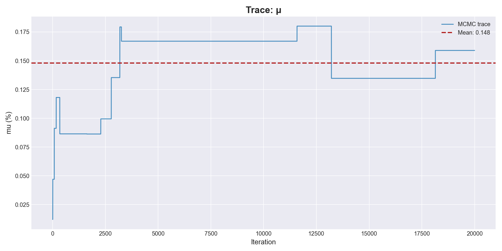
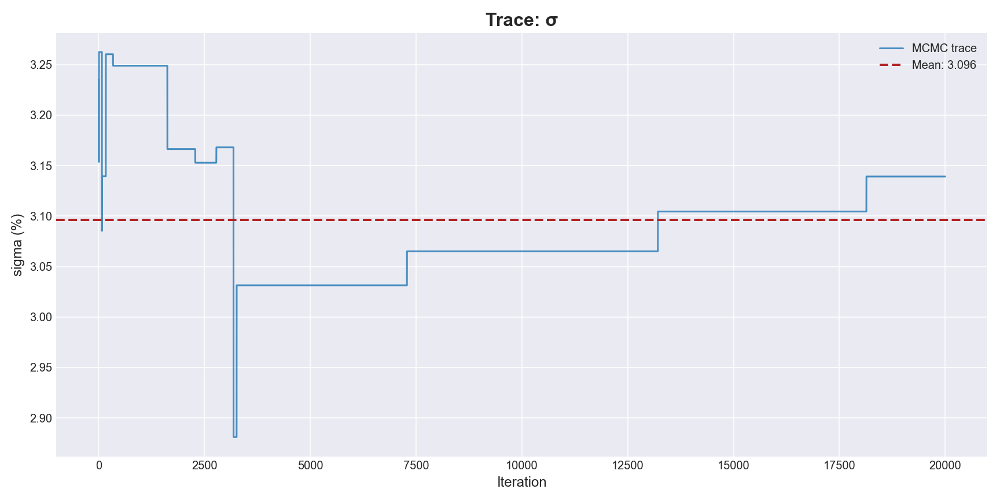
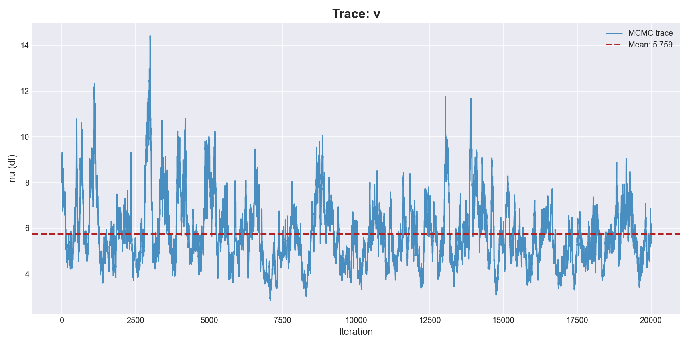
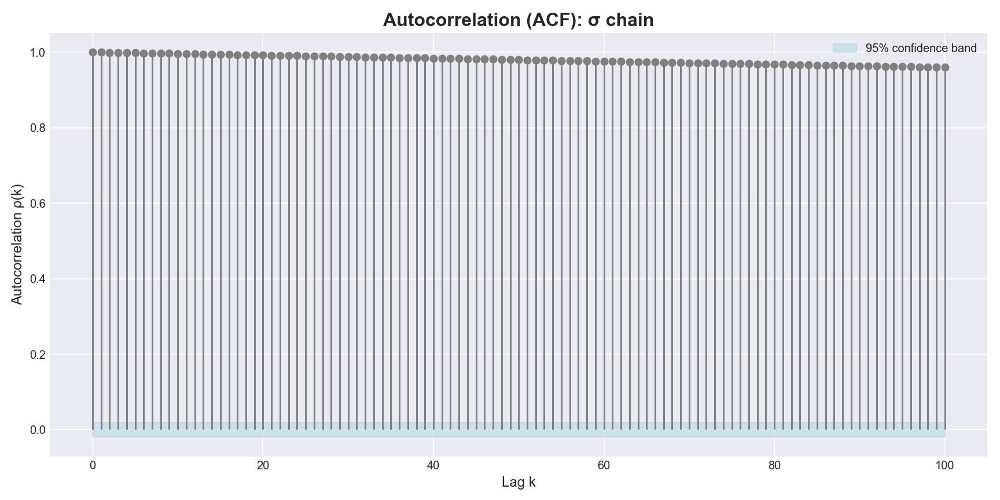
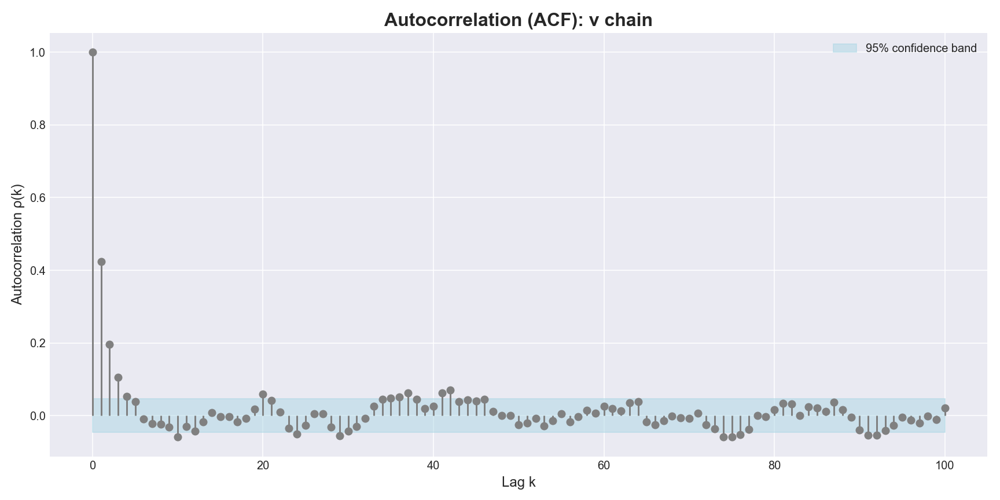
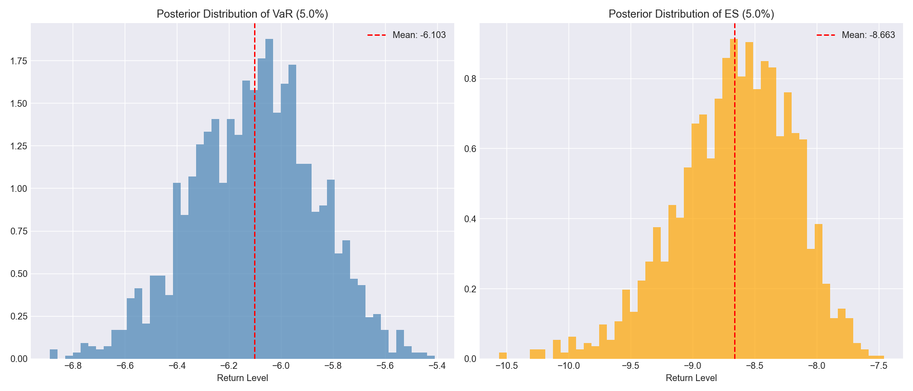

# Risk Assessment of Tesla Stock: A Bayesian MCMC Approach to VaR and ES Estimation

**Course:** STATS 211
**Team Members:** Ke Ning; Yanpei Yu; Ziying Ye
**Date:** Dec 5th, 2025

---

## 1. Introduction

This project aims to model the daily returns of Tesla Inc. (TSLA) using Bayesian statistical methods and to quantify its tail risk. Financial asset returns often exhibit "leptokurtic and fat-tailed" characteristics, meaning extreme market movements occur more frequently than predicted by a standard Gaussian distribution. Consequently, traditional risk models based on normality assumptions often underestimate potential losses.

To address this, we employ a **Student's t-distribution** model, implemented via a **Metropolis-within-Gibbs** sampling algorithm. This allows us to estimate the posterior distributions of the model parameters ($\mu, \sigma, \nu$). Based on these posterior samples, we calculate the **Value at Risk (VaR)** and **Expected Shortfall (ES)** at a 95% confidence level, providing a robust quantitative basis for risk management.

## 2. Data Description

* **Source:** Yahoo Finance, Public Market Data
* **Time Period:** January 4, 2022 – December 31, 2024 (3 Years)
* **Preprocessing:**
Daily closing prices ($P_t$) were converted into log-returns ($r_t$). For numerical stability during Bayesian inference, daily log-returns were scaled by 100 and converted into **percentage points**. Consequently, all reported parameter estimates ($\mu, \sigma$) and risk metrics (VaR, ES) are expressed in percentages (%):

$$
r_t = 100 \cdot \ln\left( \frac{P_t}{P_{t-1}} \right)
$$

* **Observation:** The dataset covers a period of significant volatility for Tesla, including multiple sharp drawdowns, confirming the necessity of a fat-tailed model.

## 3. Methodology

### 3.1 Model Specification: Scale Mixture of Normals

**Rationale:**

Directly sampling from the Student's t-distribution likelihood is computationally challenging. To facilitate efficient parameter estimation, we adopt the Scale Mixture of Normals representation. This hierarchical structure decomposes the heavy-tailed t-distribution into a conditional Normal distribution weighted by a latent variable $\lambda_t$.

Mathematical Formulation

For each daily return $r_t$, the model is defined as:

$$
\begin{aligned}
    r_t \mid \mu, \sigma^2, \lambda_t &\sim \mathcal{N}\left(\mu, \frac{\sigma^2}{\lambda_t}\right) \\
    \lambda_t \mid \nu &\sim \text{Gamma}\left(\frac{\nu}{2}, \frac{\nu}{2}\right)
\end{aligned}
$$

**Role of Latent Variables:**

The variable $\lambda_t$ acts as a local precision weight. When an extreme market event occurs (an outlier), the model assigns a small $\lambda_t$ (close to 0), inflating the variance and effectively down-weighting that observation's influence on the mean estimation. This mechanism grants the model its robustness against fat-tailed data.

### 3.2 Prior Specification & Strategy

We adopt a Bayesian hierarchical framework with the following prior distributions for our parameters:

$$
\begin{aligned}
    \text{Location: } \quad & \mu \sim \mathcal{N}(0, \tau_\mu^2) \\
    \text{Variance: } \quad & \sigma^2 \sim \text{Inverse-Gamma}(\alpha, \beta) \\
    \text{Degrees of Freedom: } \quad & \nu \sim \text{Exponential}(\lambda)
\end{aligned}
$$

To ensure the priors are weakly informative, we set the hyperparameters as follows: $\tau_\mu = 100$, $\alpha = 0.01$, $\beta = 0.01$, and the mean of the exponential distribution for $\nu$ was set to 30.

Strategic Choice for Variance ($\sigma^2$): Inverse-Gamma vs. Half-Cauchy

While the Half-Cauchy distribution is often theoretically preferred for its robustness, we selected the Inverse-Gamma prior for its significant computational advantages in this specific framework.

* **Conjugacy & Efficiency:** The Inverse-Gamma is the conjugate prior for the variance of a Normal distribution. This property allows us to analytically derive the full conditional posterior and implement an exact **Gibbs Sampling** step for **$\sigma^2$**.
* **Performance:** Unlike the Half-Cauchy prior, which would require a Metropolis-Hastings update with tuning issues and lower acceptance rates, Gibbs sampling ensures a **100% acceptance rate** . This drastically improves the mixing and Effective Sample Size (ESS) of our MCMC chain.

### 3.3 Sampling Algorithm: Metropolis-within-Gibbs (MwG)

To estimate the posterior distribution, we employ a hybrid **Metropolis-within-Gibbs** sampler. This algorithm alternates between exact Gibbs sampling for parameters with conjugate priors (**$\boldsymbol{\lambda}, \sigma^2$**) and Metropolis-Hastings (MH) steps for others (**$\mu, \nu$**).

Step 1: Gibbs Update for Latent Weights ($\boldsymbol{\lambda}$)

We sample the latent weight $\lambda_t$ for each observation directly from its conditional Gamma posterior. The likelihood of the data $r_t$ (conditional on $\lambda_t$) is Normal, while the prior for $\lambda_t$ is a Gamma distribution. Due to the conjugacy between the Normal likelihood (with respect to precision) and the Gamma prior, the resulting posterior for each $\lambda_t$ is also Gamma.

This step automatically down-weights outliers (where residuals are large). The conditional distribution is

$$
\lambda_t \mid r_t, \mu, \sigma^2, \nu \sim \text{Gamma}\left( \frac{\nu + 1}{2}, \frac{\nu + (r_t - \mu)^2 / \sigma^2}{2} \right)
$$

Step 2: Gibbs Update for Variance ($\sigma^2$)

Leveraging the Inverse-Gamma (IG) conjugate prior, we derive the exact conditional posterior for the variance. This allows for direct sampling with a 100% acceptance rate, significantly improving sampling efficiency compared to MH updates.

$$
\sigma^2 \mid \mathbf{r}, \boldsymbol{\lambda}, \mu, \nu \sim \text{Inverse-Gamma}\left(\alpha + \frac{N}{2}, \beta + \frac{1}{2} \sum_{t=1}^{N} \lambda_t (r_t - \mu)^2\right)
$$

Step 3: Metropolis-Hastings Update for $\mu$ and $\nu$

The parameters $\mu$ and $\nu$ (transformed as $\eta = \ln(\nu)$ or similar for stability) do not have standard conjugate conditionals in this setting. We update them using a Random Walk Metropolis-Hastings step:

1. **Proposal** : Generate a candidate **$\theta_{prop}$** by adding a normally distributed error to the current value: **$\theta_{prop} = \theta_{curr} + \mathcal{N}(0, \delta^2)$**.
2. Acceptance Probability: Calculate the ratio of the posterior probabilities:
   $$
   \alpha = \min\left(1, \frac{P(\theta_{prop} \mid \mathbf{r}, \boldsymbol{\lambda}, \dots)}{P(\theta_{curr} \mid \mathbf{r}, \boldsymbol{\lambda}, \dots)}\right)
   $$
3. **Decision** : Accept the new parameter with probability **$\alpha$**; otherwise, retain the current value.

* **Tuning** : The step sizes (**$\delta$**) for **$\mu$** and **$\eta$** were tuned to achieve optimal acceptance rates (approximately 30-40%) to ensure efficient exploration of the parameter space.

## 4. Diagnostics & Validation

To ensure the validity of our MCMC results, we performed standard convergence checks.

### 4.1 Trace Plots & Geweke test

* **Analysis:** The trace plots for $\mu$, $\sigma$, and $\nu$ exhibit a stable "caterpillar" pattern with no discernible trend. This indicates that the chain has successfully converged to the stationary distribution after the burn-in period.

<div align="center">
     
</div>

<div align="center">
    
</div>

<div align="center">
    
</div>

+ **Geweke Diagnostics:** The Geweke Z-scores for all parameters are well within the critical range of **$[-1.96, 1.96]$** (**$\mu$**: -0.062, **$\sigma$**: -0.856, **$\nu$**: -0.578), statistically confirming convergence.

### 4.2 Autocorrelation (ACF)

* **Analysis:** High autocorrelation is inherently expected in hierarchical models due to the coupling between the volatility **$\sigma$** and latent variables **$\boldsymbol{\lambda}$**. However, by extending the chain to 100,000 iterations, we achieved robust **Effective Sample Sizes (ESS)** (**$\mu \approx 1800$**, **$\sigma \approx 800$**, **$\nu \approx 559$**). These values are sufficient to produce reliable posterior estimates and stable Credible Intervals (CI). Burn-in and thinning were applied as described in the Methods section.

<div align="center">
     
</div>

<div align="center">
    
</div>

<div align="center">
    
</div>

### 5.3 Risk Quantification

We estimated the risk metrics at the 95% confidence level (**$\alpha = 0.05$**) using the full posterior distribution. The uncertainty of these estimates is visualized in the posterior histograms.

<div align="center">
    
</div>

## 5. Results & Risk Analysis

### 5.1 Posterior Estimates


| **Parameter**                  | **Mean** | **95% Credible Interval** | **ESS** | **Interpretation**                              |
| -------------------------------- | ---------- | --------------------------- | --------- | ------------------------------------------------- |
| **$\mu$ (Location)**           | 0.029%   | [-0.222%, 0.277%]         | 1800.0  | Daily expected return is close to zero.         |
| **$\sigma$ (Scale)**           | 3.105%   | [2.823%, 3.398%]          | 800.6   | Captures the baseline daily volatility.         |
| **$\nu$ (Degrees of Freedom)** | 5.759    | [3.723, 9.093]            | 558.8   | Low $\nu$ (< 10) confirms significant fat tails. |

### 5.2 Metric Calculation: Analytical Approach

Instead of relying solely on empirical quantiles from the simulated returns, we calculate the **Value at Risk (VaR)** and **Expected Shortfall (ES)** analytically for each posterior sample. This approach leverages the closed-form solutions of the Student's t-distribution, reducing sampling noise.

For a return series **$r_t \sim t_\nu(\mu, \sigma^2)$** and a significance level **$\alpha$** (e.g., 0.05), the metrics are defined as follows:

1.  **Value at Risk (VaR)**

VaR represents the quantile of the loss distribution.

$$
\text{VaR}_\alpha = \mu + \sigma \cdot t_\nu^{-1}(\alpha)
$$

Where $t_\nu^{-1}(\alpha)$ is the $\alpha$-quantile of the standard Student's t-distribution with $\nu$ degrees of freedom.

2. Expected Shortfall (ES)

ES represents the expected loss given that the loss exceeds the VaR threshold. For $\nu > 1$, the analytical solution is:

$$
\text{ES}_\alpha = \mu - \sigma \cdot \frac{f_\nu(t_\nu^{-1}(\alpha))}{\alpha} \frac{\nu + (t_\nu^{-1}(\alpha))^2}{\nu - 1}
$$

Where $f_\nu(\cdot)$ is the probability density function (PDF) of the standard t-distribution and $t_\nu^{-1}(\alpha)$ is its $\alpha$-quantile.

### 5.3 Risk Quantification

We estimated the risk metrics at the 95% confidence level (**$\alpha = 0.05$**) using the full posterior distribution. The uncertainty of these estimates is visualized in the posterior histograms.

<div align="center">
    
</div>


| **Metric**                  | **Mean Estimate** | **95% Credible Interval** |
| ----------------------------- | ------------------- | --------------------------- |
| **Value at Risk (VaR)**     | **-6.11%**        | **[-6.58%, -5.66%]**      |
| **Expected Shortfall (ES)** | **-8.67%**        | **[-9.70%, -7.85%]**      |

**Business Interpretation:**

* **VaR (-6.11%):** Under normal market conditions, there is a 95% probability that Tesla's daily loss will **not exceed 6.11%** . Conversely, we expect a loss greater than 6.11% to occur roughly once every 20 trading days.
* **ES (-8.67%):** In the worst 5% of scenarios (i.e., when a crash occurs and the VaR threshold is breached), the **average expected loss is 8.67%** . This metric captures the "tail risk" or the severity of extreme downturns, which is significantly deeper than the VaR boundary suggests.

### 5.4 Upside Potential: The Symmetry of Volatility

While VaR and ES focus on downside risk, the Student's t-distribution is symmetric. The estimated high volatility (**$\sigma \approx 3.10\%$**) and heavy tails (**$\nu \approx 5.76$**) imply that the risk is bilateral.

* **Interpretation:** The model suggests that Tesla's stock has an **Upside Potential** (95% right-tail quantile) of approximately **+6.11%** .
* **Insight:** This symmetry characterizes Tesla as a typical high-volatility technology stock: investors must tolerate the significant risk of drawdown (VaR -6.11%) as the "price" for accessing equally significant potential for rapid gains. The heavy tails indicate that "surprise" rallies are just as likely as "surprise" crashes.

## 6. Conclusion

This project successfully implemented a Bayesian hierarchical Student-t model to quantify the risk profile of Tesla (TSLA) stock. By utilizing a Metropolis-within-Gibbs sampler with a conjugate Inverse-Gamma prior, we achieved robust parameter estimation and convergence.

**Key Findings:**

1. **Confirmation of Heavy Tails:** The posterior degrees of freedom **$\nu \approx 5.76$** strongly rejects the Normal distribution assumption, confirming that extreme market events occur far more frequently than traditional models predict.
2. **Quantified Risk:** We estimated the 95% **Value at Risk (VaR) at -6.11%** and **Expected Shortfall (ES) at -8.67%** . These metrics highlight a significant tail risk, where the potential average loss in extreme scenarios deepens by over 2.5% beyond the VaR threshold.
3. **High Volatility Profile:** The baseline volatility (**$\sigma \approx 3.11\%$**) and the symmetric nature of the t-distribution characterize Tesla as a high-risk, high-reward asset with substantial upside and downside potential.

---

*Appendix: Python code and diagnostic files are attached.*

```python
import os
import pandas as pd
import numpy as np
from scipy import stats
import matplotlib.pyplot as plt
import matplotlib as mpl

# ===================================================================
# 1) Global Configuration
# ===================================================================
BASE_DIR = os.path.dirname(os.path.abspath(__file__))
CSV_PATH = os.path.join(BASE_DIR, "Tesla_close.csv")  # Data file path
RETURNS_ARE_PERCENT = False        # Whether returns in CSV are already in percentage

OUT_DIR = os.path.join(BASE_DIR, "outputs")
if not os.path.exists(OUT_DIR):
    os.makedirs(OUT_DIR)

REPORT_FILENAME = "analysis_report.txt"

N_ITER    = 100000  # Total MCMC iterations
BURN_FRAC = 0.1    # Burn-in fraction

# MH step size (needs adjustment based on acceptance rate)(percentage of the total N_iter)
STEP_MU   = 0.30 # Slightly larger step to decrease acceptance and boost ESS
STEP_ETA  = 0.2

SEED = 42 # Random seed for reproducibility

# ===================================================================
# Journal-ready plotting style configuration
# ===================================================================
def set_style():
    """Configure Matplotlib to produce publication-quality figures."""
    plt.style.use('seaborn-v0_8-white') # clean white background
  
    # Override parameters to better match journal guidelines
    mpl.rcParams.update({
        # Typography: prefer serif fonts (Times New Roman family)
        'font.family': 'serif',
        'font.serif': ['Times New Roman', 'Times', 'DejaVu Serif', 'serif'],
        'mathtext.fontset': 'stix', # math font family
        'font.size': 12,
        'axes.labelsize': 13,
        'axes.titlesize': 14,
        'axes.titleweight': 'bold', # bold axis titles
        'xtick.labelsize': 11,
        'ytick.labelsize': 11,
        'legend.fontsize': 10,
  
        # Lines and axes appearance
        'axes.linewidth': 1.0,       # moderate frame weight
        'axes.edgecolor': 'black',
        'axes.grid': False,          # disable grid unless explicitly needed
        'lines.linewidth': 1.5,
  
        # High-resolution outputs
        'figure.dpi': 150,
        'savefig.dpi': 300,          # 300 DPI
        'figure.constrained_layout.use': True,
    })

# Apply the style as soon as the script loads
set_style()

# ===================================================================

# ============ Utility Functions ============

def load_returns(csv_path, returns_are_percent=True):
    """Load return data from the CSV file."""
    df = pd.read_csv(csv_path)
    r = df['Log_Return'].dropna().values
    if not returns_are_percent:
        r = r * 100.0
    return r

# ---------- Priors ----------
def logprior(theta, tau_mu, alpha_ig, beta_ig, mean_nu_star):
    """
        log prior:
            mu ~ N(0, tau_mu^2)
            sigma^2 ~ Inverse-Gamma(alpha_ig, beta_ig)
            nu ~ Exponential(mean = mean_nu_star)
        Note: the code works in (log_sigma, eta) space, so include Jacobian +log_sigma + eta
    """
    mu, log_sigma, eta = theta
    sigma   = np.exp(log_sigma)      # sigma > 0
    sigma2  = sigma ** 2
    nu = np.exp(eta)                 # nu > 0

    # Normal prior on mu
    lp = stats.norm.logpdf(mu, 0.0, tau_mu)

    # Inverse-gamma prior on sigma^2 (log density)
    lp += stats.invgamma.logpdf(sigma2, a=alpha_ig, scale=beta_ig)

    # Exponential prior on nu (mean = mean_nu_star; rate = 1/mean)
    rate = 1.0 / mean_nu_star
    lp += np.log(rate) - rate * nu

    # Jacobian correction for sigma = exp(log_sigma) and nu = exp(eta)
    lp += log_sigma + eta
    return lp

# ---------- Hierarchical likelihood ----------
def loglik_normal_given_lambda(theta, r, lam):
    """
        Conditional likelihood given latent λ_t:
            r_t | λ_t ~ Normal(mu, sigma^2 / λ_t)
        Here theta = (mu, log_sigma, eta); eta only matters for sampling λ.
    """
    mu, log_sigma, _ = theta
    sigma = np.exp(log_sigma)  # true scale
    # For each t: variance = sigma^2 / lam_t
    var_t = (sigma ** 2) / lam
    # Sum log-normal densities in a numerically stable fashion
    # log N(r | mu, var_t) = -0.5*log(2π) - 0.5*log(var_t) - (r-mu)^2 / (2*var_t)
    ll = -0.5 * np.log(2.0 * np.pi) * len(r)
    ll += -0.5 * np.sum(np.log(var_t))
    ll += -0.5 * np.sum(((r - mu) ** 2) / var_t)
    return ll

def loglik_lambda_given_nu(lam, nu):
    """
    log P(lambda | nu) with lambda_t ~ Gamma(shape=nu/2, rate=nu/2)
    """
    shape = nu / 2.0
    rate  = nu / 2.0 # scipy notation: scale = 1/rate
    # Use scipy's logpdf directly (vectorized)
    return np.sum(stats.gamma.logpdf(lam, a=shape, scale=1.0/rate))

def logpost_hier(theta, r, lam, tau_mu, alpha_ig, beta_ig, mean_nu_star):
    mu, log_sigma, eta = theta
    nu = np.exp(eta)
  
    # 1. log P(r | lam, mu, sigma)
    ll_r = loglik_normal_given_lambda(theta, r, lam)
  
    # 2. log P(theta)
    lp_theta = logprior(theta, tau_mu, alpha_ig, beta_ig, mean_nu_star)
  
    # 3. log P(lam | nu)
    ll_lam = loglik_lambda_given_nu(lam, nu)
  
    return ll_r + lp_theta + ll_lam

# ---------- Gibbs sampling for λ_t ----------
def gibbs_sample_lambda(r, mu, sigma, nu):
    """
        Perform one Gibbs sweep for λ_{1:n}:
            λ_t | r_t, mu, sigma, nu ~ Gamma((nu+1)/2, rate = (nu + ((r_t-mu)^2 / sigma^2)) / 2)
        SciPy uses the (shape, scale) parameterization, so scale = 1/rate.
        Returns lam shaped [n,].
    """
    n = len(r)
    shape = (nu + 1.0) / 2.0
    # rate_t = ( nu + ((r_t - mu)^2 / sigma^2) ) / 2
    rate_t = (nu + ((r - mu) ** 2) / (sigma ** 2)) / 2.0
    scale_t = 1.0 / rate_t  # SciPy expects scale = 1/rate

    # Sample each t independently (vectorized); scipy supports vectorized scales
    lam = stats.gamma.rvs(a=shape, scale=scale_t, size=n)
    return lam

# ============ Metropolis-within-Gibbs sampler (minimal modification) ============

def mwg_sampler(r,
                n_iter, burn_frac,
                step_mu, step_eta,
                tau_mu, alpha_ig, beta_ig, mean_nu_star,
                random_seed,
                init=None, thin=50):
    """
        Metropolis-within-Gibbs (MwG):
            1) Gibbs: sample the full λ vector given (mu, sigma, nu)
            2) Gibbs: exploit inverse-gamma conjugacy to sample sigma^2
            3) MH: random-walk updates for (mu, eta)
        Unlike pure MH, λ and sigma^2 both have Gibbs steps.
    """
    rng = np.random.default_rng(random_seed)

    # ------ Initialize θ and λ ------
    if init is None:
        mu0   = 0.0
        logs0 = np.log(np.std(r, ddof=1)) # sample standard deviation
        eta0  = np.log(8.0)   # initial nu ≈ 8
        theta = np.array([mu0, logs0, eta0], dtype=float)
    else:
        theta = np.array(init, dtype=float)

    # Start λ by running a single conditional Gibbs update (all ones would also work)
    mu, log_sigma, eta = theta
    sigma = np.exp(log_sigma)
    nu    = np.exp(eta)
    lam   = gibbs_sample_lambda(r, mu, sigma, nu)

    mh_indices = (0, 2)  # indices for mu and eta within theta
    mh_steps   = np.array([step_mu, step_eta], dtype=float)
    acc        = np.zeros(len(mh_indices), dtype=int)
    chain   = np.zeros((n_iter, 3), dtype=float)  # store θ trajectory
    lp_cur  = logpost_hier(theta, r, lam, tau_mu, alpha_ig, beta_ig, mean_nu_star)

    # ------ Main sampling loop ------
    for it in range(n_iter):
        # (A) Gibbs update for full λ (always accepted)
        mu, log_sigma, eta = theta
        sigma = np.exp(log_sigma)
        nu    = np.exp(eta)
        lam   = gibbs_sample_lambda(r, mu, sigma, nu)

        # (B) Gibbs update for sigma^2 via IG conjugacy
        resid = r - mu
        shape_post = alpha_ig + len(r) / 2.0
        scale_post = beta_ig + 0.5 * np.sum(lam * (resid ** 2))
        sigma2 = stats.invgamma.rvs(a=shape_post, scale=scale_post, random_state=rng)
        log_sigma = 0.5 * np.log(sigma2)
        theta[1] = log_sigma

        # Refresh log posterior for upcoming MH step
        lp_cur = logpost_hier(theta, r, lam, tau_mu, alpha_ig, beta_ig, mean_nu_star)

        # (C) MH updates for mu and eta
        for idx, param_idx in enumerate(mh_indices):
            prop = theta.copy()
            prop[param_idx] += rng.normal(0.0, mh_steps[idx])  # symmetric normal move

            # Evaluate log posterior at proposal (likelihood conditioned on lam)
            lp_prop = logpost_hier(prop, r, lam, tau_mu, alpha_ig, beta_ig, mean_nu_star)

            # MH accept rule using log comparison
            if np.log(rng.random()) <= (lp_prop - lp_cur):
                theta  = prop
                lp_cur = lp_prop
                acc[idx] += 1

        chain[it, :] = theta

    # ------ Return posterior draws and acceptance stats ------
    burn     = int(burn_frac * n_iter)
    # Thin the chain to improve ACF behavior
    post     = chain[burn::thin, :]
    acc_rate = np.array([acc[0] / n_iter, 1.0, acc[1] / n_iter])
    return post, acc_rate, chain

def calculate_var_es(mu_samps, sigma_samps, nu_samps, alpha=0.05):
    """
    Compute Value at Risk (VaR) and Expected Shortfall (ES)
    using closed-form Student-t formulas.
  
    Parameters:
    alpha: tail probability (default 0.05 for 95% confidence).
        We focus on the left tail (losses).
   
    Returns:
    var_samps: posterior draws of VaR (usually negative)
    es_samps:  posterior draws of ES (typically more negative)
    """
    n = len(mu_samps)
    var_samps = np.zeros(n)
    es_samps = np.zeros(n)
  
    # Iterate across posterior draws
    for i in range(n):
        mu  = mu_samps[i]
        sig = sigma_samps[i]
        nu  = nu_samps[i]
  
        # 1. VaR is the alpha-quantile of the fitted t distribution
        q_std = stats.t.ppf(alpha, df=nu)
        var_samps[i] = mu + sig * q_std
  
        if nu <= 1:
            # nu <= 1 implies undefined expectations (Cauchy case)
            es_samps[i] = -np.inf 
        else:
            pdf_q = stats.t.pdf(q_std, df=nu)
            es_std_term = - ((nu + q_std**2) / (nu - 1)) * (pdf_q / alpha)
            es_samps[i] = mu + sig * es_std_term
    
    return var_samps, es_samps


# --------------------------
# 5) Plotting helpers
# --------------------------

# Academic color palette
COLOR_HIST   = '#4A6FA5'  # muted steel blue
COLOR_KDE    = '#8B0000'  # deep red
COLOR_TRACE  = '#2E4053'  # slate gray
COLOR_MEAN   = '#C0392B'  # brick red
COLOR_ACF_BAR= '#2C3E50'  # ACF bars
COLOR_ACF_CI = '#D6EAF8'  # confidence interval fill

def plot_hist(x, title, xlabel, outpath):
    """Beautified histogram with an overlaid KDE curve."""
    fig = plt.figure()
    ax  = fig.add_subplot(111)
    # Histogram
    ax.hist(x, bins=50, density=True, alpha=0.5, color=COLOR_HIST, edgecolor='white', linewidth=0.5, label="Posterior samples histogram")
    # KDE overlay
    kde = stats.gaussian_kde(x)
    x_range = np.linspace(x.min(), x.max(), 200)
    ax.plot(x_range, kde(x_range), color=COLOR_KDE, linewidth=2, label="KDE estimate")
    ax.set_title(title)
    ax.set_xlabel(xlabel)
    ax.set_ylabel("Density")
    ax.legend(frameon=False, loc='upper right')
    ax.spines['top'].set_visible(False)
    ax.spines['right'].set_visible(False)
    fig.savefig(outpath)
    plt.close(fig)

def plot_trace(x, title, ylabel, outpath):
    """Beautified MCMC trace plot with its mean highlighted."""
    fig = plt.figure(figsize=(10, 4))
    ax  = fig.add_subplot(111)
    ax.plot(x, alpha=0.9, color=COLOR_TRACE, linewidth=0.5, label="MCMC trace")
    # Highlight posterior mean
    mean_val = np.mean(x)
    ax.axhline(mean_val, color=COLOR_MEAN, linestyle='--', linewidth=1.5, label=f"Mean: {mean_val:.3f}")
    ax.set_title(title)
    ax.set_xlabel("Iteration")
    ax.set_ylabel(ylabel)
    ax.margins(x=0)
    ax.spines['top'].set_visible(False)
    ax.spines['right'].set_visible(False)
    ax.legend(frameon=False, loc='upper right')
    fig.savefig(outpath)
    plt.close(fig)

def acf_1d(x, max_lag=100):
    """
    Compute the sample autocorrelation ρ(k) for k in [0, max_lag], where ρ(0)=1.
    """
    x = np.asarray(x, dtype=float)
    x = x - x.mean()
    n = len(x)
    if n < 2:
        return np.array([1.0])
    ac_full = np.correlate(x, x, mode='full')
    ac = ac_full[n-1:n+max_lag]
    denom = ac[0]
    if denom <= 0:
        return np.zeros_like(ac)
    acf = ac / denom
    return acf

def plot_acf_series(x, title, outpath, max_lag=100):
    """
    Beautified ACF plot with an added confidence band.
    """
    n = len(x)
    rho = acf_1d(x, max_lag=max_lag)
    fig = plt.figure(figsize=(8, 4))
    ax = fig.add_subplot(111)
    lags = np.arange(len(rho))
    # 95% confidence band (±1.96/sqrt(n))
    conf_level = 1.96 / np.sqrt(n)
    ax.fill_between(lags, -conf_level, conf_level, color=COLOR_ACF_CI, alpha=0.4, zorder=1, label="95% Confidence Band")
    ax.axhline(0, color='gray', linestyle='-', linewidth=0.8, zorder=2)
    # Lollipop-style ACF visualization
    markerline, stemlines, baseline = ax.stem(lags, rho, basefmt=' ')
    # Customize stems
    plt.setp(stemlines, linewidth=1.2, color=COLOR_ACF_BAR)   # thin stems
    plt.setp(markerline, markersize=4, color=COLOR_ACF_BAR)   # small markers
    plt.setp(baseline, visible=False)
    ax.set_title(f"Autocorrelation (ACF): {title}")
    ax.set_xlabel("Lag k")
    ax.set_ylabel("Autocorrelation ρ(k)")
    ax.set_ylim(min(rho.min(), -conf_level)*1.2, 1.1)
    ax.spines['top'].set_visible(False)
    ax.spines['right'].set_visible(False)
    fig.savefig(outpath)
    plt.close(fig)

def ess_from_acf(x, max_lag=200):
    """
    ACF-based ESS estimate:
    ESS ≈ n / (1 + 2 * sum_{k>=1} ρ(k)).
    Uses paired truncation (stop when ρ(k)+ρ(k+1) <= 0) to avoid noisy tails.
    """
    rho = acf_1d(x, max_lag=max_lag)
    n = len(x)
    s = 0.0
    for k in range(1, len(rho), 2):
        pair = rho[k] + (rho[k+1] if k+1 < len(rho) else 0.0)
        if pair <= 0:
            break
        s += pair
    tau = 1.0 + 2.0 * s        # integrated autocorrelation time
    return n / max(tau, 1e-12) # guard against division by zero

def geweke_diagnostic(chain, first=0.1, last=0.5):
    """
    Performs the Geweke diagnostic test.
    Compares the mean of the first 10% of the chain with the last 50%.
    Returns a Z-score. 
    |Z| > 1.96 indicates non-convergence (at 5% significance level).
    """
    # 1. Split the chain
    n = len(chain)
    n_first = int(n * first)
    n_last  = int(n * last)
  
    if n_first == 0 or n_last == 0:
        return np.nan
  
    data_first = chain[:n_first]
    data_last  = chain[-n_last:]
  
    # 2. Calculate Means
    mean_first = np.mean(data_first)
    mean_last  = np.mean(data_last)
  
    # 3. Calculate Variance (corrected for autocorrelation)
    # Approximation: Var(mean) = Var(x) / ESS
    # We use the ess_from_acf function you already have
    var_first = np.var(data_first, ddof=1) / ess_from_acf(data_first)
    var_last  = np.var(data_last, ddof=1) / ess_from_acf(data_last)
  
    # 4. Calculate Z-score
    z_score = (mean_first - mean_last) / np.sqrt(var_first + var_last)
  
    return z_score


# --------------------------
# 6) Main workflow
# --------------------------
def main():
    """Load data, run the sampler, and produce diagnostics."""
    # Returns are measured in percentages
    r = load_returns(CSV_PATH, returns_are_percent=RETURNS_ARE_PERCENT)

    # Simple hyperparameter configuration with fixed scales
    hyper_params = {
        "tau_mu":       100,      # prior std for mu, aligned with data scale
        "alpha_ig":     0.01,     # weakly informative shape
        "beta_ig":      0.01,     # fixed scale parameter
        "mean_nu_star": 30.0      # weakly informative prior mean for nu
    }

    # Run the sampler
    post, acc_rate, chain = mwg_sampler(r,
                                        n_iter=N_ITER,
                                        burn_frac=BURN_FRAC,
                                        step_mu=STEP_MU,
                                        step_eta=STEP_ETA,
                                        random_seed=SEED,
                                        **hyper_params)

    # Analyze and plot
    analyze_and_plot_results(r=r,
                             post=post,
                             chain=chain,
                             acc_rate=acc_rate,
                             sampler_name="Metropolis-within-Gibbs",
                             hyper_params=hyper_params)

def analyze_and_plot_results(r, post, chain, acc_rate, sampler_name, hyper_params):
    """
    Post-process, analyze, plot, and save the MCMC output.
    """
    # Convert posterior samples back to original parameterization
    mu_samps    = post[:, 0]
    sigma_samps = np.exp(post[:, 1])
    nu_samps    = np.exp(post[:, 2])

    # Posterior medians (used as plug-in estimates)
    mu_med = float(np.median(mu_samps))
    sig_med = float(np.median(sigma_samps))
    nu_med = float(np.median(nu_samps))

    # ---- Posterior histograms (μ, σ, ν) ----
    plot_hist(mu_samps,    r"Posterior of $\mu$", r"$\mu$ (%)",
              os.path.join(OUT_DIR, "post_mu_hist.png"))
    plot_hist(sigma_samps, r"Posterior of $\sigma$", r"$\sigma$ (%)",
              os.path.join(OUT_DIR, "post_sigma_hist.png"))
    plot_hist(nu_samps,    r"Posterior of $\nu$", r"$\nu$ (df)",
              os.path.join(OUT_DIR, "post_nu_hist.png"))

    # ---- Trace plots (μ, σ, ν) using full chain ----
    plot_trace(chain[:, 0], r"Trace: $\mu$", r"$\mu$ (%)",
               os.path.join(OUT_DIR, "trace_mu.png"))
    plot_trace(np.exp(chain[:, 1]), r"Trace: $\sigma$", r"$\sigma$ (%)",
               os.path.join(OUT_DIR, "trace_sigma.png"))
    plot_trace(np.exp(chain[:, 2]), r"Trace: $\nu$", r"$\nu$ (df)",
               os.path.join(OUT_DIR, "trace_nu.png"))
  
    # ---- ACF plots for μ, σ, ν ----
    plot_acf_series(mu_samps,    r"$\mu$ chain", os.path.join(OUT_DIR, "acf_mu.png"),    max_lag=100)
    plot_acf_series(sigma_samps, r"$\sigma$ chain", os.path.join(OUT_DIR, "acf_sigma.png"), max_lag=100)
    plot_acf_series(nu_samps,    r"$\nu$ chain", os.path.join(OUT_DIR, "acf_nu.png"),    max_lag=100)

    # Summary table
    ess_vals = [
        ess_from_acf(mu_samps),
        ess_from_acf(sigma_samps),
        ess_from_acf(nu_samps),
    ]

    summary = pd.DataFrame({
        "param": ["mu(%)", "sigma(%)", "nu"],
        "median": [mu_med, sig_med, nu_med],
        "mean": [np.mean(mu_samps), np.mean(sigma_samps), np.mean(nu_samps)],
        "sd": [np.std(mu_samps, ddof=1),
                np.std(sigma_samps, ddof=1),
                np.std(nu_samps, ddof=1)],
        "p2.5": [np.percentile(mu_samps, 2.5),
                  np.percentile(sigma_samps, 2.5),
                  np.percentile(nu_samps, 2.5)],
        "p97.5": [np.percentile(mu_samps, 97.5),
                   np.percentile(sigma_samps, 97.5),
                   np.percentile(nu_samps, 97.5)],
        "ess": ess_vals,
    })
    summary_table = summary.to_string(index=False)
  
    # Calculate Geweke Z-scores
    z_mu = geweke_diagnostic(mu_samps)
    z_sigma = geweke_diagnostic(sigma_samps)
    z_nu = geweke_diagnostic(nu_samps)
  
    print("-" * 30)
    print("Geweke Diagnostics (Z-scores):")
    print(f"  Mu:    {z_mu:.3f}")
    print(f"  Sigma: {z_sigma:.3f}")
    print(f"  Nu:    {z_nu:.3f}")
    print("  (|Z| < 1.96 suggests convergence)")
    print("-" * 30)
  
    # ==========================================
    # Risk metrics (VaR & ES)
    # ==========================================
    ALPHA = 0.05 
  
    print(f"\nCalculating VaR and ES at alpha={ALPHA}...")
    var_chain, es_chain = calculate_var_es(mu_samps, sigma_samps, nu_samps, alpha=ALPHA)
  
    # Filter out nu <= 1 draws which make ES undefined
    valid_mask = np.isfinite(es_chain)
    invalid_es_count = int(np.sum(~valid_mask))
    if invalid_es_count > 0:
        print(f"Warning: {invalid_es_count} samples had nu <= 1 (ES undefined).")
        var_chain = var_chain[valid_mask]
        es_chain  = es_chain[valid_mask]
  
    # Summary stats
    var_mean = np.mean(var_chain)
    var_lower = np.percentile(var_chain, 2.5)
    var_upper = np.percentile(var_chain, 97.5)
  
    es_mean = np.mean(es_chain)
    es_lower = np.percentile(es_chain, 2.5)
    es_upper = np.percentile(es_chain, 97.5)
  
    # Console summary
    print("-" * 40)
    print(f"Risk Measures (alpha={ALPHA*100}%) Summary:")
    print("-" * 40)
    print(f"Value-at-Risk (VaR):")
    print(f"  Mean Estimate: {var_mean:.4f}")
    print(f"  95% CI:       [{var_lower:.4f}, {var_upper:.4f}]")
    print(f"\nExpected Shortfall (ES):")
    print(f"  Mean Estimate: {es_mean:.4f}")
    print(f"  95% CI:       [{es_lower:.4f}, {es_upper:.4f}]")
    print("-" * 40)
  
    # Optional posterior plots for VaR and ES
    fig, axes = plt.subplots(1, 2, figsize=(10, 5))
  
    # VaR histogram
    axes[0].hist(var_chain, bins=50, density=True, alpha=0.5, 
                 color='#1F618D', edgecolor='white', linewidth=0.5) # deep blue tone
    axes[0].axvline(var_mean, color='#C0392B', linestyle='--', linewidth=1.5, label=f'Mean: {var_mean:.3f}')
    axes[0].set_title(f"Posterior Distribution of VaR ({ALPHA*100:.0f}%)")
    axes[0].set_xlabel("Return Level")
    axes[0].set_ylabel("Density")
    axes[0].legend(frameon=True, fancybox=False)
  
    # ES histogram
    axes[1].hist(es_chain, bins=50, density=True, alpha=0.5, 
                 color='#D68910', edgecolor='white', linewidth=0.5) # muted orange tone
    axes[1].axvline(es_mean, color='#C0392B', linestyle='--', linewidth=1.5, label=f'Mean: {es_mean:.3f}')
    axes[1].set_title(f"Posterior Distribution of ES ({ALPHA*100:.0f}%)")
    axes[1].set_xlabel("Return Level")
    axes[1].legend(frameon=True, fancybox=False)
  
    plt.tight_layout()
    plt.savefig(os.path.join(OUT_DIR, "risk_posterior.png"))
    plt.close(fig)

    # Consolidated text report
    report_lines = []
    report_lines.append("=== Run Configuration ===")
    report_lines.append(f"Sampler: {sampler_name}")
    report_lines.append(f"Iterations: {len(chain)}, burn-in fraction: {BURN_FRAC}")
    report_lines.append("")
    report_lines.append("Hyperparameters:")
    for key, value in hyper_params.items():
        report_lines.append(f"  {key}: {value}")
    report_lines.append("")
    report_lines.append("Acceptance rates (mu, log_sigma, eta): " + ", ".join(f"{x:.3f}" for x in acc_rate))
    report_lines.append("ESS (mu, sigma, nu): " + ", ".join(f"{x:.1f}" for x in ess_vals))
    report_lines.append("")
    report_lines.append("Posterior summary table:")
    report_lines.extend(summary_table.splitlines())
    report_lines.append("")
    report_lines.append("Geweke diagnostics (Z-scores):")
    report_lines.append(f"  mu   : {z_mu:.3f}")
    report_lines.append(f"  sigma: {z_sigma:.3f}")
    report_lines.append(f"  nu   : {z_nu:.3f}")
    report_lines.append("(|Z| < 1.96 suggests convergence)")
    report_lines.append("")
    report_lines.append(f"VaR mean (alpha={ALPHA*100:.1f}%): {var_mean:.4f}")
    report_lines.append(f"VaR 95% CI: [{var_lower:.4f}, {var_upper:.4f}]")
    report_lines.append(f"ES mean  (alpha={ALPHA*100:.1f}%): {es_mean:.4f}")
    report_lines.append(f"ES 95% CI: [{es_lower:.4f}, {es_upper:.4f}]")
    if invalid_es_count > 0:
        report_lines.append(f"Warning: {invalid_es_count} samples discarded because nu <= 1 made ES undefined.")

    report_path = os.path.join(OUT_DIR, REPORT_FILENAME)
    with open(report_path, "w", encoding="utf-8") as fh:
        fh.write("\n".join(report_lines))

    print("Posterior summaries and diagnostics saved to the outputs/ folder.")
    print(f"Detailed text report written to: {report_path}")


if __name__ == "__main__":
    main()
```
